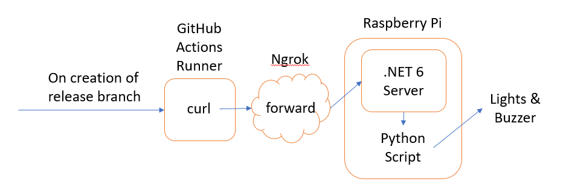
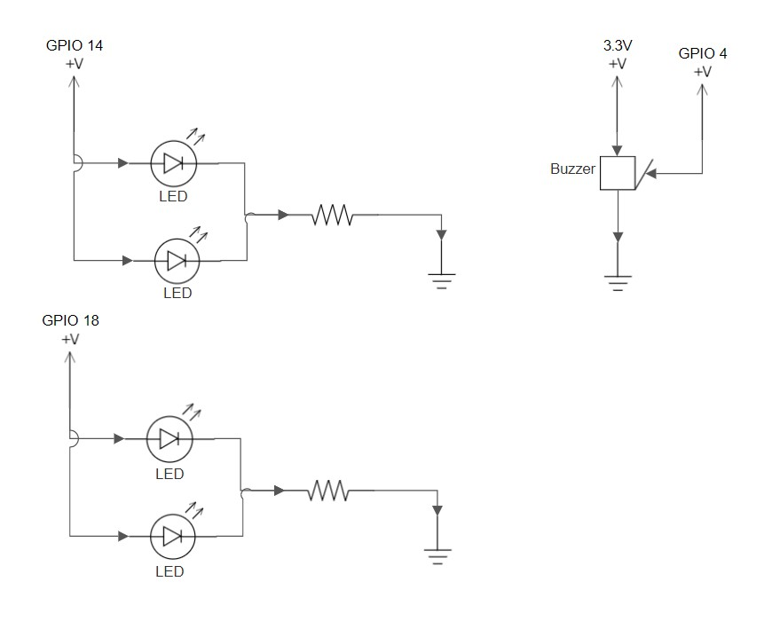

# Developer Guide

## Big Idea



1. When a release branch is created, the GitHub Actions Runner sends a HTTP Request to the ngrok's endpoint. This action is specified in [this .yml file](https://github.com/Zhiyuan-Amos/ReleaseBranchTester/blob/main/.github/workflows/release_branch.yml).

1. Ngrok forwards the HTTP Request to the .NET 6 Server.

1. The .NET 6 Server processes the request by [running the Python script](https://github.com/Zhiyuan-Amos/PiServer/blob/main/Program.cs#L6-L20).

1. The [Python script](https://github.com/Zhiyuan-Amos/PiServer/blob/main/pi.py) triggers the buzzer and lights. Python is used because there are [Python libraries](https://github.com/Zhiyuan-Amos/PiServer/blob/main/pi.py#L1) that allow for easy interfacing with the Raspberry Pi's GPIO. Also, as Python is an interpreted language and it is shipped with the .NET 6 Server, users can modify the Python script according to their Raspberry Pi's setup. The following image shows the default setup:



## Build

Generate the output files by on the development machine:

```
dotnet publish -r linux-arm
```

## Host

Transfer the output files to the Raspberry Pi by running on the development machine:

```
scp -r .\bin\Debug\net6.0\linux-arm\* pi@{ipAddr}:{path}
```

Host this server locally by running on the Raspberry Pi:

```
chmod +x {path}/PiServer
sudo {path}/PiServer --urls "http://localhost:80"
```

## Exposing to Public Internet

The previous step only allows local access to the server. For GitHub Actions to reach it, the server has to be exposed to the public Internet. Use `Ngrok` to do so by running this on the Raspberry Pi:

```
cd ~
wget https://bin.equinox.io/c/4VmDzA7iaHb/ngrok-stable-linux-arm.tgz
tar -xvzf ngrok-stable-linux-arm.tgz
```

Then, create an account on `ngrok`, retrieve the `authToken` and run:

```
./ngrok authtoken {authToken}
./ngrok http -bind-tls=true 80
```

The server can now be reached at the url specified by the `Forwarding` header.
